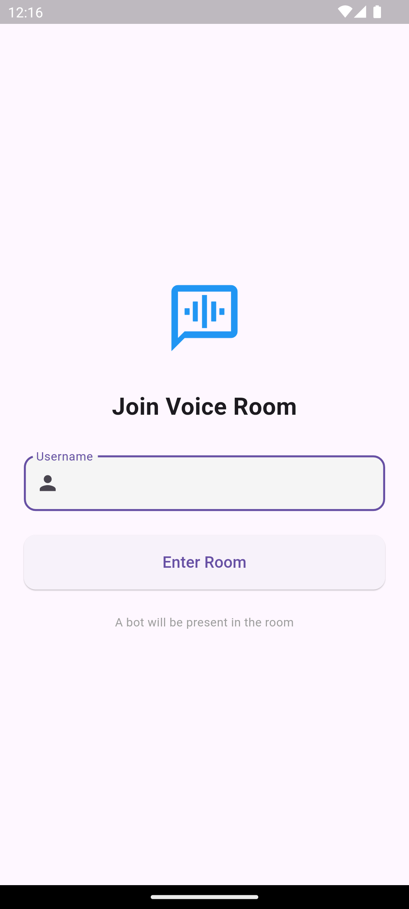
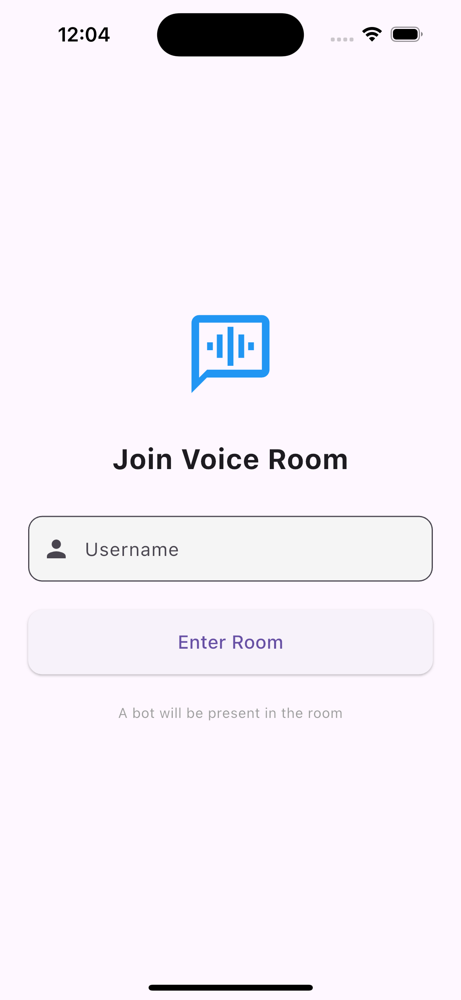
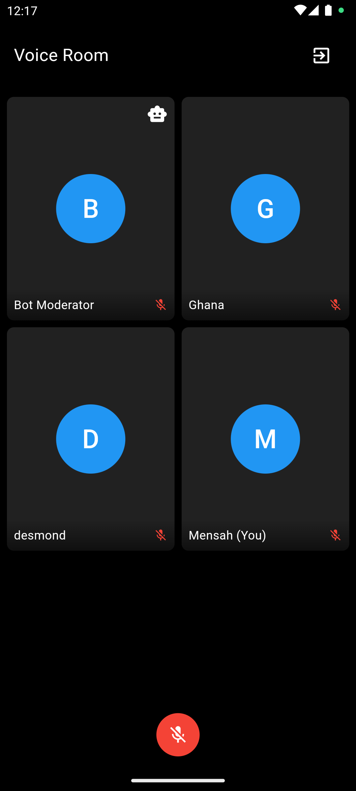
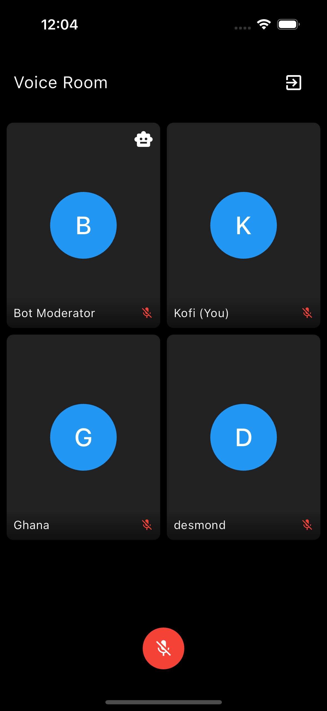

# Flutter App - Multi-User Voice 🎙️Room with Bot Moderation

## About

A sample multi-user voice room where two users can join and communicate via voice. A
bot will act as a moderator, having access to the users' voice inputs
Please follow the steps below before pushing to either prod or dev. Works on Android & iOS!


---

## 📱 Screenshots

Here's a quick preview of the app on both **Android** and **iOS**:

| **Feature**       | **Android**                                                                                 | **iOS**                                                                                    |
|--------------------|---------------------------------------------------------------------------------------------|------------------------------------------------------------------------------------------|
| **Login Screen**    |                           |                                 |
| **Voice Room Screen**    |                           |  

---

## Features 🚀

- 🎤 **Audio Conversion**: Speek and listing to others in the meeting
- 🌊 **Login**: Login with firebase.
- 🖼️ **Modern UI**: Sleek and dark-themed user interface.

## 🔧 Getting Started

Follow these instructions to get the app up and running:

## Tech Used

- Client: Flutter,

- Cross-Platform Libraries:

    1. `agora_rtc_engine: ^6.2.6`

    2. `agora_token_service: ^0.1.2`

    3. `flutter_dotenv: ^5.2.1`

    4. `permission_handler: ^11.3.1`

    5. `flutter_dotenv: ^5.2.1`

    6. `firebase_auth: ^5.3.1`

    7. `uuid: ^4.2.1`

    8. `cloud_firestore: ^5.4.4`

## Requirement for running this project

- Install flutter on your device.

- `flutter sdk: 3.24.5`

- `dart sdk: 3.5.4`

## Permissions

- Android:
  - `android/app/src/{debug,main,profile}/AndroidManifest.xml`
      ```
      <uses-permission android:name="android.permission.RECORD_AUDIO" />
      <uses-permission android:name="android.permission.MODIFY_AUDIO_SETTINGS" />
    ```

- IOS
  - `ios/Runner/Info.plist`

    ```
    <key>NSMicrophoneUsageDescription</key>
  	<string>Your voice input needed for communication functionality</string>
  	<key>NSSpeechRecognitionUsageDescription</key>
  	<string>Allow app to get text input from your speech</string>
    ```

  - `ios/Podfile`
    - First refer the [guide](https://pub.dev/packages/permission_handler#setup)
    - Uncomment these lines

    ```
          PermissionGroup.microphone
          'PERMISSION_MICROPHONE=1',

           PermissionGroup.speech
          'PERMISSION_SPEECH_RECOGNIZER=1',
    ```

## Installation/Running project

After cloning this repository, migrate to the folder. Then, follow the following steps:

- Step 1:

    run: `flutter clean`

- Step 2:

    run: `flutter pub get`

- Step 3:

    run: `flutter run`

## How to generate apk/appbundle

- apk:

    run: `flutter build apk`

- appbundle:

    run: `flutter build appbundle`

## Feedback

If you have any feedback, please reach out to us:

  [Boadu Jeff Atakora](https://www.linkedin.com/in/boadu-jeff-atakora-a930aa153/overlay/contact-info/)
