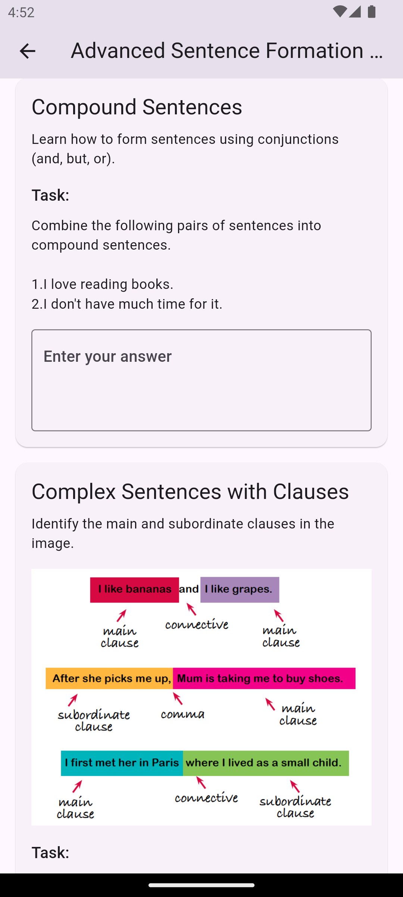

# Flutter App - Dynamic Module and Level Rendering

## About

An app to render learning modules and levels (referred to as "cakes") based on
backend data. The app should reflect any changes in modules or cakes without requiring code
modifications.
Please follow the steps below before pushing to either prod or dev. Works on Android & iOS!

## 📱 Screenshots

Here's a quick preview of the app on both **Android** and **iOS**:

| **Feature**       | **Android**                                                                                 | **iOS**                                                                                    |
|--------------------|---------------------------------------------------------------------------------------------|------------------------------------------------------------------------------------------|
| **Permission Screen**    |                           |                                 |
| **Home Screen**    |                           |                                 |
| **Basic Speech** |                     |                          |
| **Basic Grammar**|                   |                        |
| **Advance Sentence Formation**|                   |                        |
| **Advance Sentence Formation**|                   |                        |

---

## Features 🚀

- ✍️ **Text Tasks**: Enter text and listen to it being spoken aloud.
- 🖼️ **Image Tasks**: Adjust the pitch, speed, and volume of the voice.
- 🎤 **Audio Tasks**: A dynamic wave effect visualizing the playback.

## 🔧 Getting Started

Follow these instructions to get the app up and running:

## Tech Used

- Client: Flutter,

## Requirement for running this project

- Install flutter on your device.

- `flutter sdk: 3.24.5`

- `dart sdk: 3.5.4`

## Installation/Running project

After cloning this repository, migrate to the folder. Then, follow the following steps:

- Step 1:

    run: `flutter clean`

- Step 2:

    run: `flutter pub get`

- Step 3:

    run: `flutter run`

## How to generate apk/appbundle

- apk:

    run: `flutter build apk`

- appbundle:

    run: `flutter build appbundle`