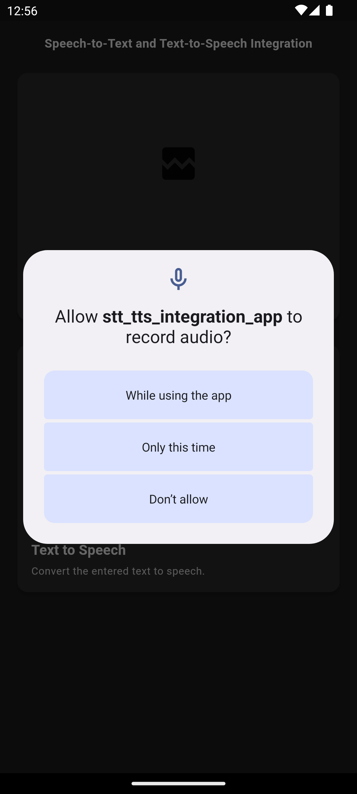
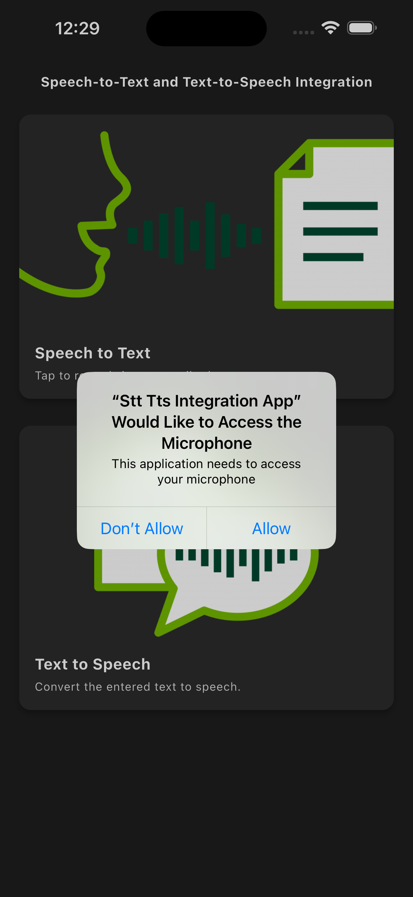
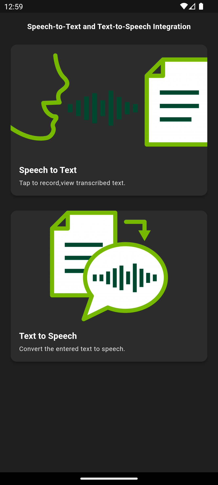
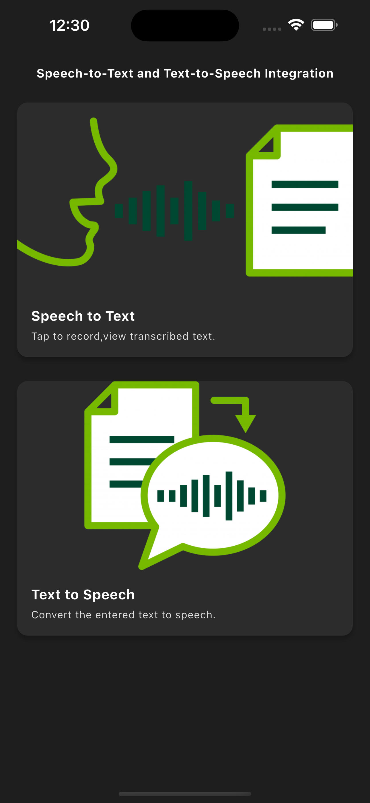
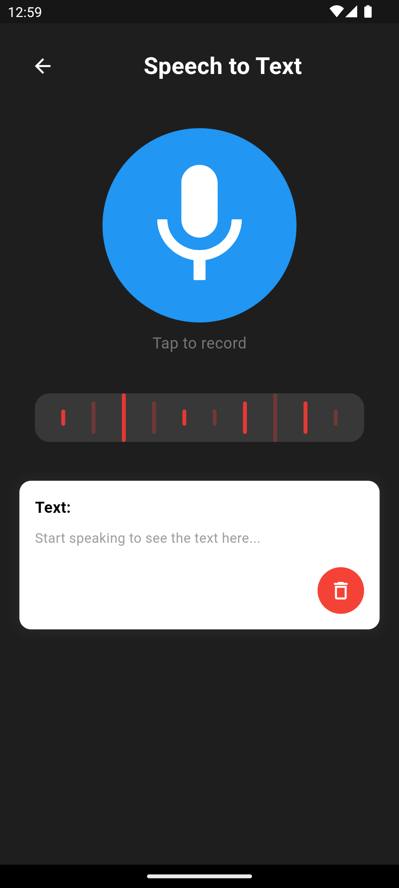
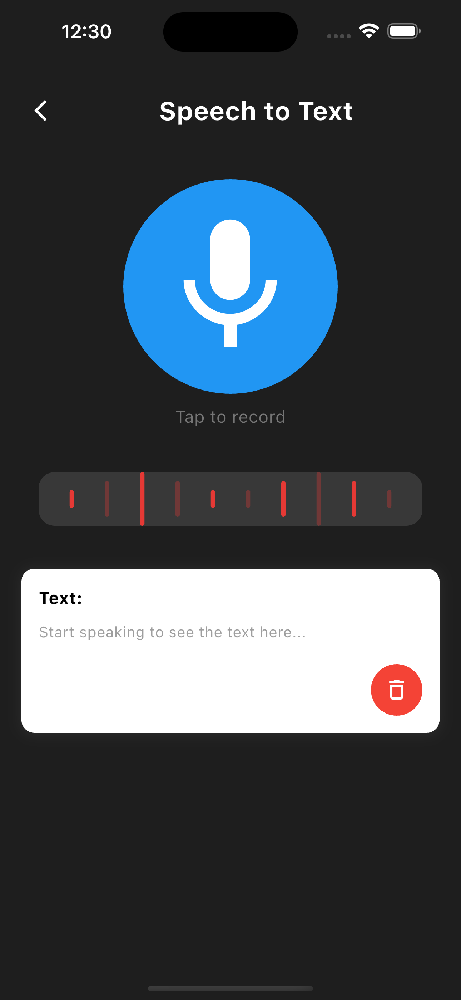
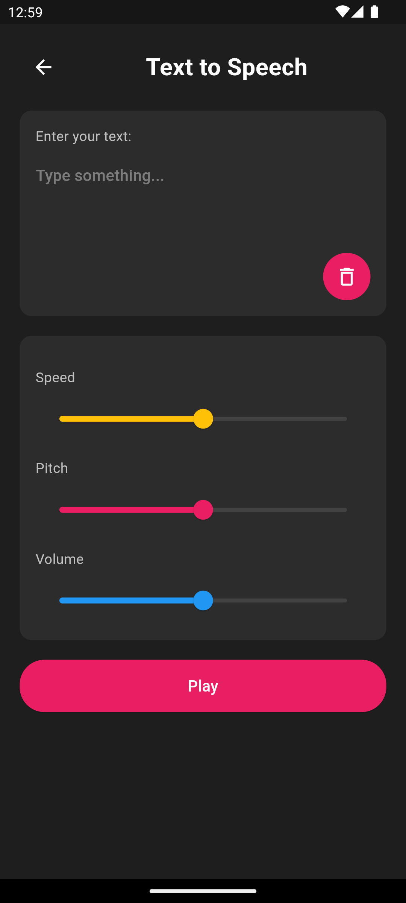
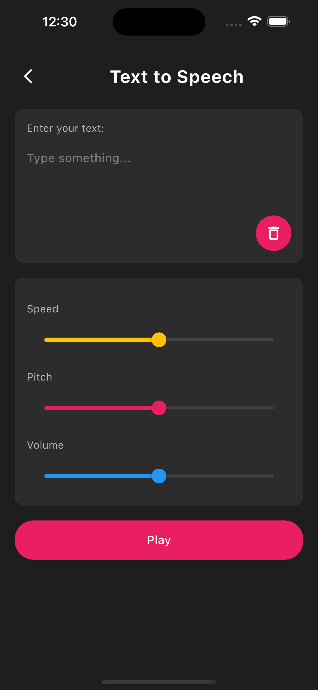

# Flutter App - Speech-to-Text and Text-to-Speech with Wave Visualizer 🎙️  Integration

## About

An app for transcribing speech to text and converting text to speech
Please follow the steps below before pushing to either prod or dev. Works on Android & iOS!

---

## 📱 Screenshots

Here's a quick preview of the app on both **Android** and **iOS**:

| **Feature**       | **Android**                                                                                 | **iOS**                                                                                    |
|--------------------|---------------------------------------------------------------------------------------------|------------------------------------------------------------------------------------------|
| **Permission Screen**    |                           |                                 |
| **Home Screen**    |                           |                                 |
| **Audio Controls** |                     |                          |
| **Wave Visualizer**|                   |                        |

---

## Features 🚀

- 🎤 **Text-to-Speech Conversion**: Enter text and listen to it being spoken aloud.
- ⚙️ **Audio Control**: Adjust the pitch, speed, and volume of the voice.
- 🌊 **Wave Visualizer**: A dynamic wave effect visualizing the playback.
- 🖼️ **Modern UI**: Sleek and dark-themed user interface.

## 🔧 Getting Started

Follow these instructions to get the app up and running:

## Tech Used

- Client: Flutter,

- Cross-Platform Libraries:

    1. `flutter_tts: ^4.2.0`

    2. `speech_to_text: ^6.6.0`

    3. `livespeechtotext: ^1.0.9`

    4. `permission_handler: ^11.3.1`

## Requirement for running this project

- Install flutter on your device.

- `flutter sdk: 3.24.5`

- `dart sdk: 3.5.4`

## Permissions

- Android:
  - `android/app/src/{debug,main,profile}/AndroidManifest.xml`
      ```
      <uses-permission android:name="android.permission.RECORD_AUDIO" />
      <uses-permission android:name="android.permission.MODIFY_AUDIO_SETTINGS" />
    ```

- IOS
  - `ios/Runner/Info.plist`

    ```
    <key>NSMicrophoneUsageDescription</key>
  	<string>Your voice input needed for the speech to text functionality</string>
  	<key>NSSpeechRecognitionUsageDescription</key>
  	<string>Allow app to get text input from your speech</string>
    ```

  - `ios/Podfile`
    - First refer the [guide](https://pub.dev/packages/permission_handler#setup)
    - Uncomment these lines

    ```
          PermissionGroup.microphone
          'PERMISSION_MICROPHONE=1',

           PermissionGroup.speech
          'PERMISSION_SPEECH_RECOGNIZER=1',
    ```

## Installation/Running project

After cloning this repository, migrate to the folder. Then, follow the following steps:

- Step 1:

    run: `flutter clean`

- Step 2:

    run: `flutter pub get`

- Step 3:

    run: `flutter run`

## How to generate apk/appbundle

- apk:

    run: `flutter build apk`

- appbundle:

    run: `flutter build appbundle`

## Feedback

If you have any feedback, please reach out to us:

  [Boadu Jeff Atakora](https://www.linkedin.com/in/boadu-jeff-atakora-a930aa153/overlay/contact-info/)
